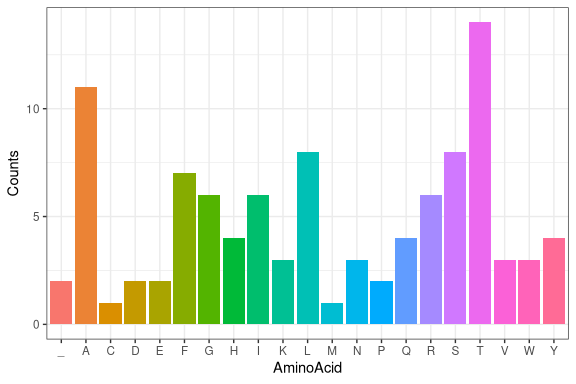

**GitHub repository:**
<https://github.com/rforbiodatascience25/group_18_package>

``` r
library(molecularr)
```

## Package functions (overview)

f1: generate_dna_string(n): create a random DNA sequence of length n
(A/C/G/T).

f2: dna_to_rna(x): transcribe DNA → RNA (replace T with U).

f3: split_codons(x): split a nucleotide sequence into triplets (codons).

f4: translate_codons(x): translate codons to amino acids (standard
genetic code).

f5: count_bases(x, plot = TRUE): count A/C/G/T (or A/C/G/U for RNA) and
(optionally) plot a bar chart.

## Complete Workflow Example

``` r
#SET a seed for a repeated example
set.seed(1)

#DNA String creation
DNA_STRING <- generate_dna_string(300)

#DNA TRANSCRIPTION

RNA_STRING <- RNA(DNA_STRING)

#Splitting codns

CODON_LIST <- codon_split(RNA_STRING)

#Translation

AMINOACID_STRING <-  func_4(CODON_LIST)

#Counting aminoacid and plotting

plot_sequence_counts(AMINOACID_STRING)
```

<!-- -->

## Use case and potential extensions

A potential use case for this package is in genetic research and
education, where the goal is to simulate the process of DNA
transcription and translation to better understand how genetic sequences
lead to protein synthesis. For example, students or researchers could
generate random DNA strings, transcribe them into RNA, and then
translate them into amino acid sequences to visualize how mutations
alter proteins.

In synthetic biology, this kind of package could be used to prototype
artificial gene designs, simulating how a designed DNA sequence would be
expressed into a target protein before laboratory synthesis. This helps
test hypotheses computationally, saving time and resources before moving
into wet-lab experiments.

Additional functions could further enhance the simulation realism, such
as validating DNA or RNA sequences for correctness (checking for invalid
bases or incomplete codons), reverse-transcribing RNA back into
complementary DNA (cDNA), simulating mRNA splicing where introns are
removed to yield mature mRNA sequences, and introducing mutations at
defined rates to model genetic variation or evolution.

## Why it’s a good idea to limit the number of dependencies your package has

It is a good idea to limit the number of dependencies your package has
because fewer external packages mean fewer chances of breakage when
upstream packages change or are removed. It also makes your package
faster to install, easier to maintain, more portable, and more
CRAN-friendly, since reviewers often flag excessive dependencies,
especially if they are only used for minor tasks.

However, dependencies cannot always be avoided. If your package relies
heavily on another (for example, ggplot2 for plotting or dplyr for data
wrangling), importing it is justified. Rewriting well-tested functions
is inefficient and error-prone, so it is better to rely on reliable,
existing code. Dependencies are also necessary when your package is
meant to interoperate with others, such as extending tidymodels or
Bioconductor tools, or when other packages offer optimized,
battle-tested solutions that outperform custom code.

Difference between @importFrom package function and using
package::function()

The difference between using @importFrom package function in roxygen2
and package::function() lies mainly in how functions are accessed.

@importFrom package function is a documentation directive that tells R,
via the NAMESPACE file, to import a specific function from another
package when your package is loaded. For example: \#’ @importFrom
stringr str_split adds importFrom(stringr, str_split) to your NAMESPACE
file. This allows you to call str_split() directly without prefixing the
package name, which is convenient if the function is used often.
However, it increases coupling between packages and makes it less clear
where each function comes from.

Using package::function() is explicit namespace access. You call a
function from another package without importing it, for example:
stringr::str_split(DNA_STRING, ““). This approach makes it clearer which
package the function belongs to, avoids modifying your NAMESPACE file,
and reduces name conflicts, though it can be more verbose if used
frequently.

In general, use package::function() when you only need a function once
or twice, and @importFrom package function when the dependency is
central and used repeatedly throughout your package.
